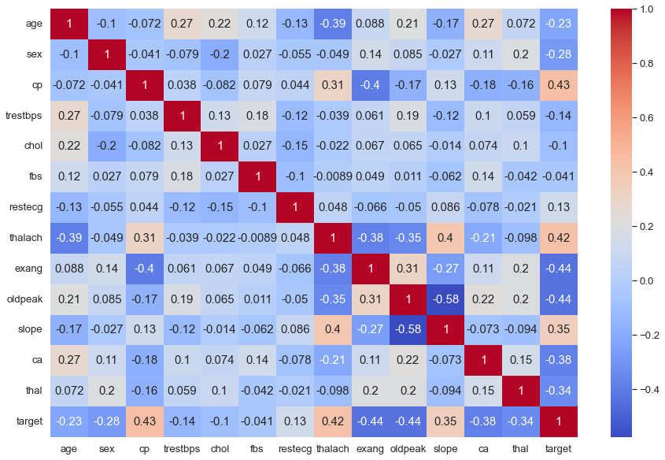

# Introduction

In this repository we implement various Machine Learning (ML) techniques applied on the *__cancer dataset__* (__./dataset/heart_disease.csv__)
to predict wether given a patient with particular symptoms is likely to be affected by cancer or not.

---
### *__Dataset__*
The provided dataset contains the following features:

|      |   age |   sex |   cp |   trestbps |   chol |   fbs |   restecg |   thalach |   exang |   oldpeak |   slope |   ca |   thal |   target |
|-----:|------:|------:|-----:|-----------:|-------:|------:|----------:|----------:|--------:|----------:|--------:|-----:|-------:|---------:|
|    0 |    52 |     1 |    0 |        125 |    212 |     0 |         1 |       168 |       0 |       1   |       2 |    2 |      3 |        0 |
|    1 |    53 |     1 |    0 |        140 |    203 |     1 |         0 |       155 |       1 |       3.1 |       0 |    0 |      3 |        0 |
|    2 |    70 |     1 |    0 |        145 |    174 |     0 |         1 |       125 |       1 |       2.6 |       0 |    0 |      3 |        0 |
...
| 1023 |    50 |     0 |    0 |        110 |    254 |     0 |         0 |       159 |       0 |       0   |       2 |    0 |      2 |        1 |
| 1024 |    54 |     1 |    0 |        120 |    188 |     0 |         1 |       113 |       0 |       1.4 |       1 |    1 |      3 |        0 |

- **age**: The person's age in years
- **sex**: The person's sex (1 = male, 0 = female)
- **cp**: The chest pain experienced (Value 1: typical angina, Value 2: atypical angina, Value 3: non-anginal pain, Value 4: asymptomatic)
- **trestbps**: The person's resting blood pressure (mm Hg on admission to the hospital)
- **chol**: The person's cholesterol measurement in mg/dl
- **fbs**: The person's fasting blood sugar (> 120 mg/dl, 1 = true; 0 = false)
- **restecg**: Resting electrocardiographic measurement (0 = normal, 1 = having ST-T wave abnormality, 2 = showing probable or definite left ventricular hypertrophy by Estes' criteria)
- **thalach**: The person's maximum heart rate achieved
- **exang**: Exercise induced angina (1 = yes; 0 = no)
- **oldpeak**: ST depression induced by exercise relative to rest ('ST' relates to positions on the ECG plot. See more here)
- **slope**: the slope of the peak exercise ST segment (Value 1: upsloping, Value 2: flat, Value 3: downsloping)
- **ca**: The number of major vessels (0-3)
- **thal**: A blood disorder called thalassemia (3 = normal; 6 = fixed defect; 7 = reversable defect)
- **target**: Heart disease (0 = no, 1 = yes)

### *__Data visualization__*
Here we perform a series of visualization to analyze the data
distribution. 
- __Histogram__


- __Density plot__


- __Correlation Matrix__



- __Target class distribution__


---
### *__Implemented model performance__*
| Models | Accuracy |
| ------ | :--------:|
|Linear Regression | __0.84__|
 

The methods implemented are listed as follows:
```
1. Linear Regression
2. K Nearest Neighbors
```
# TODO - List
- [x] Support Vector Classifier
- [x] Decision Tree Classifier
- [x] Random Forest Classifier