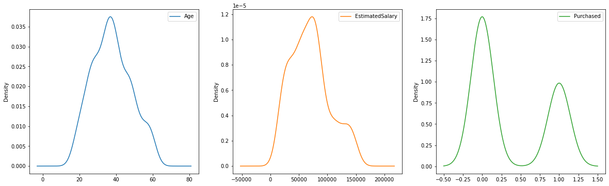
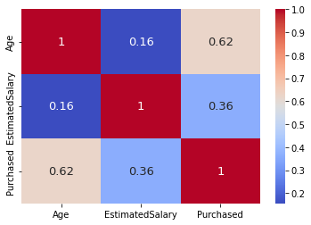
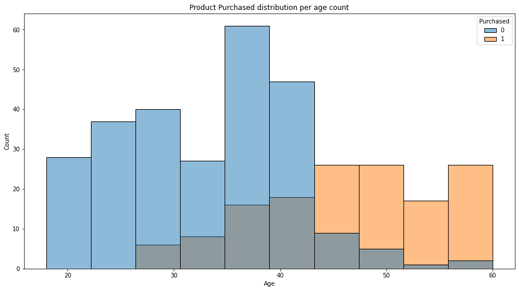
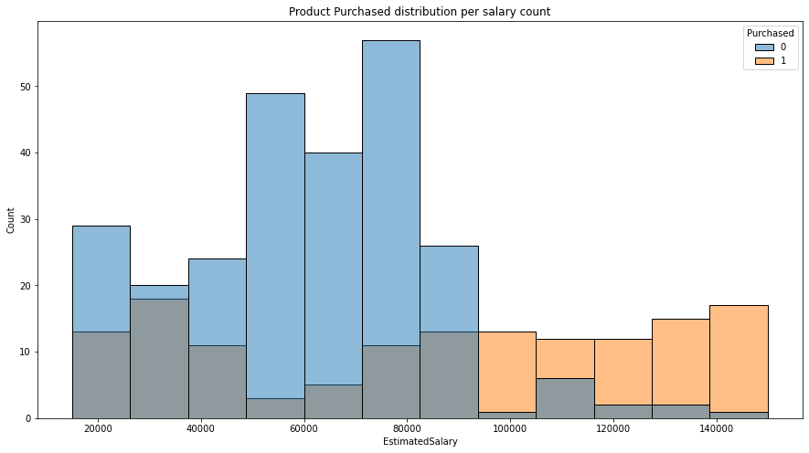

# **Social Media ads Analysis**
In machine learning, classification refers to the process of training a model to determine which category an entry belongs to. Because there are so many classification algorithms in machine learning, demonstrating a complete comparison of classification algorithms in machine learning will be an exciting and unique computer learning project for a novice. For this work, you must first select a classification-based issue statement and identify any classification algorithms that may be applicable to your situation. Following that, you must train classification models and compare their performance. We will be working on a social media marketing dataset __(./dataset/social_media_ads.csv)__

---
## __1. Dataset__
The datset is composed of 3 features the __age__ of the user, 
the __EstimatedSalary__ of the user and __Purchased__ which indicates
if the user purchases the ads or not.

|    |   Age |   EstimatedSalary |   Purchased |
|---:|:------:|:------------------:|:------------:|
|  0 |    19 |             19000 |           0 |
|  1 |    35 |             20000 |           0 |
|  2 |    26 |             43000 |           0 |
|  3 |    27 |             57000 |           0 |
|  4 |    19 |             76000 |           0 |

## __2. Data exploratory__

- __Density distribution __

This graph shows the data distribution, by observing it, we can see how
distributed is the data. 

- __Confusion Matrix__

The correlation matrix demonstrates how related are the data.

- __Product purchased distribution per age count__

This graph shows the product purchased by users based on their age count.

- __Product purchased distribution per salary count__
This graph shows the product purchased by users based on their salary count.

---
## __3. Model Training and evaluation__

Here, we present the models implemented as well as their performance:

|    | **Classification models**        |   **Model Performance** |
|---:|:-----------------------------|:--------------------:|
|  0 | __decision_tree__                |               __0.925__ |
|  1 | __knn_classifier__               |               __0.8__   |
|  2 | __logistic_regression__          |               __0.65__  |
|  3 | __svm_classifier__               |               __0.775__ |
|  4 | __bernouilli_classifier__        |               __0.65__  |
|  5 | __passive_agressive_classifier__ |               __0.65__ |

## __Conclusion__
In this tutorial we went over an implementation of multiple 
classification algorithms as well as a detail data processing
step.
