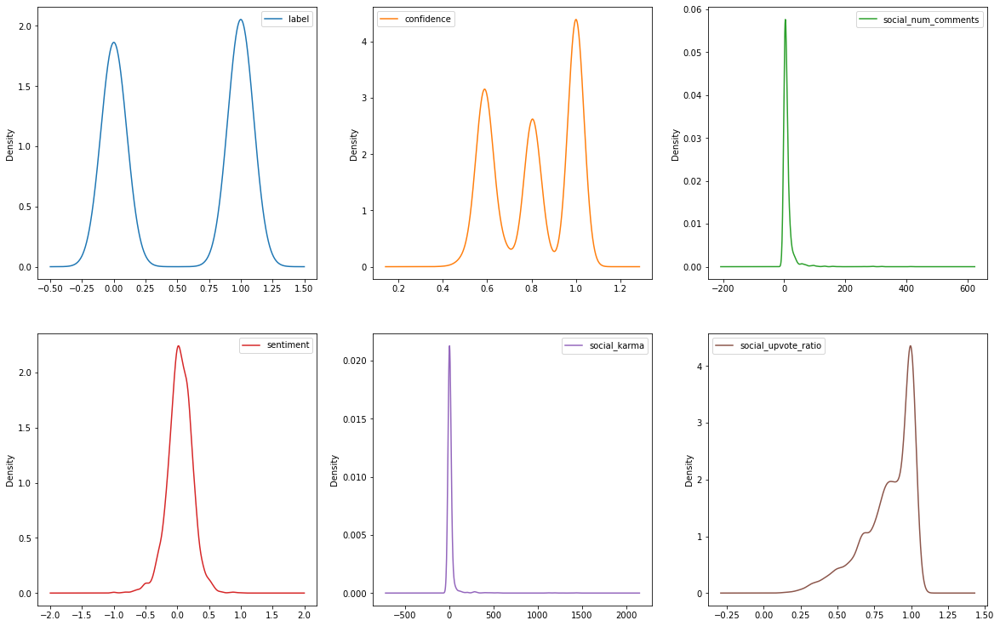

# **<u>Stress Detection with Machine Learning</u>**
People's mental health is being jeopardized by stress, worry, and despair. Everyone has a reason for being stressed out. People frequently share their emotions on social media sites such as Instagram in the form of posts and stories, and on Reddit in the form of subreddits where they ask for advice regarding their lives. Many content artists have stepped forward in recent years to provide content to assist individuals with their mental health. Many organizations may utilize stress detection to swiftly identify which social media users are stressed and assist them. This article is for you if you want to understand how to utilize machine learning to detect stress in social media posts.

## __1. Dataset__
The dataset we used contains data posted on subreddits related to mental health. This dataset contains various mental health problems shared by people about their life. Fortunately, this dataset is labelled as 0 and 1, where 0 indicates no stress and 1 indicates stress.
| subreddit   | post_id   | sentence_range   | text                                                                                                                                                                                                                                                                                                                                                                                                                                                                                                                                                                                                         |    id |   label |   confidence |   social_timestamp |   social_karma |   syntax_ari |   lex_liwc_WC |   lex_liwc_Analytic |   lex_liwc_Clout |   lex_liwc_Authentic |   lex_liwc_Tone |   lex_liwc_WPS |   lex_liwc_Sixltr |   lex_liwc_Dic |   lex_liwc_function |   lex_liwc_pronoun |   lex_liwc_ppron |   lex_liwc_i |   lex_liwc_we |   lex_liwc_you |   lex_liwc_shehe |   lex_liwc_they |   lex_liwc_ipron |   lex_liwc_article |   lex_liwc_prep |   lex_liwc_auxverb |   lex_liwc_adverb |   lex_liwc_conj |   lex_liwc_negate |   lex_liwc_verb |   lex_liwc_adj |   lex_liwc_compare |   lex_liwc_interrog |   lex_liwc_number |   lex_liwc_quant |   lex_liwc_affect |   lex_liwc_posemo |   lex_liwc_negemo |   lex_liwc_anx |   lex_liwc_anger |   lex_liwc_sad |   lex_liwc_social |   lex_liwc_family |   lex_liwc_friend |   lex_liwc_female |   lex_liwc_male |   lex_liwc_cogproc |   lex_liwc_insight |   lex_liwc_cause |   lex_liwc_discrep |   lex_liwc_tentat |   lex_liwc_certain |   lex_liwc_differ |   lex_liwc_percept |   lex_liwc_see |   lex_liwc_hear |   lex_liwc_feel |   lex_liwc_bio |   lex_liwc_body |   lex_liwc_health |   lex_liwc_sexual |   lex_liwc_ingest |   lex_liwc_drives |   lex_liwc_affiliation |   lex_liwc_achieve |   lex_liwc_power |   lex_liwc_reward |   lex_liwc_risk |   lex_liwc_focuspast |   lex_liwc_focuspresent |   lex_liwc_focusfuture |   lex_liwc_relativ |   lex_liwc_motion |   lex_liwc_space |   lex_liwc_time |   lex_liwc_work |   lex_liwc_leisure |   lex_liwc_home |   lex_liwc_money |   lex_liwc_relig |   lex_liwc_death |   lex_liwc_informal |   lex_liwc_swear |   lex_liwc_netspeak |   lex_liwc_assent |   lex_liwc_nonflu |   lex_liwc_filler |   lex_liwc_AllPunc |   lex_liwc_Period |   lex_liwc_Comma |   lex_liwc_Colon |   lex_liwc_SemiC |   lex_liwc_QMark |   lex_liwc_Exclam |   lex_liwc_Dash |   lex_liwc_Quote |   lex_liwc_Apostro |   lex_liwc_Parenth |   lex_liwc_OtherP |   lex_dal_max_pleasantness |   lex_dal_max_activation |   lex_dal_max_imagery |   lex_dal_min_pleasantness |   lex_dal_min_activation |   lex_dal_min_imagery |   lex_dal_avg_activation |   lex_dal_avg_imagery |   lex_dal_avg_pleasantness |   social_upvote_ratio |   social_num_comments |   syntax_fk_grade |   sentiment |
|:------------|:----------|:-----------------|:-------------------------------------------------------------------------------------------------------------------------------------------------------------------------------------------------------------------------------------------------------------------------------------------------------------------------------------------------------------------------------------------------------------------------------------------------------------------------------------------------------------------------------------------------------------------------------------------------------------|------:|--------:|-------------:|-------------------:|---------------:|-------------:|--------------:|--------------------:|-----------------:|---------------------:|----------------:|---------------:|------------------:|---------------:|--------------------:|-------------------:|-----------------:|-------------:|--------------:|---------------:|-----------------:|----------------:|-----------------:|-------------------:|----------------:|-------------------:|------------------:|----------------:|------------------:|----------------:|---------------:|-------------------:|--------------------:|------------------:|-----------------:|------------------:|------------------:|------------------:|---------------:|-----------------:|---------------:|------------------:|------------------:|------------------:|------------------:|----------------:|-------------------:|-------------------:|-----------------:|-------------------:|------------------:|-------------------:|------------------:|-------------------:|---------------:|----------------:|----------------:|---------------:|----------------:|------------------:|------------------:|------------------:|------------------:|-----------------------:|-------------------:|-----------------:|------------------:|----------------:|---------------------:|------------------------:|-----------------------:|-------------------:|------------------:|-----------------:|----------------:|----------------:|-------------------:|----------------:|-----------------:|-----------------:|-----------------:|--------------------:|-----------------:|--------------------:|------------------:|------------------:|------------------:|-------------------:|------------------:|-----------------:|-----------------:|-----------------:|-----------------:|------------------:|----------------:|-----------------:|-------------------:|-------------------:|------------------:|---------------------------:|-------------------------:|----------------------:|---------------------------:|-------------------------:|----------------------:|-------------------------:|----------------------:|---------------------------:|----------------------:|----------------------:|------------------:|------------:|
| ptsd        | 8601tu    | (15, 20)         | He said he had not felt that way before, suggeted I go rest and so ..TRIGGER AHEAD IF YOUI'RE A HYPOCONDRIAC LIKE ME: i decide to look up "feelings of doom" in hopes of maybe getting sucked into some rabbit hole of ludicrous conspiracy, a stupid "are you psychic" test or new age b.s., something I could even laugh at down the road. No, I ended up reading that this sense of doom can be indicative of various health ailments; one of which I am prone to.. So on top of my "doom" to my gloom..I am now f'n worried about my heart. I do happen to have a physical in 48 hours.                  | 33181 |       1 |          0.8 |         1521614353 |              5 |      1.80682 |           116 |               72.64 |            15.04 |                89.26 |            1    |          29    |             12.93 |          87.07 |               56.03 |              16.38 |            12.07 |         9.48 |          0    |           0.86 |             1.72 |               0 |             4.31 |               3.45 |           19.83 |               7.76 |              5.17 |            4.31 |              1.72 |           16.38 |           6.03 |               3.45 |                0.86 |              1.72 |             1.72 |              8.62 |              1.72 |               6.9 |           0.86 |             2.59 |           3.45 |              3.45 |                 0 |                 0 |                 0 |            1.72 |              11.21 |               3.45 |             0.86 |               2.59 |              5.17 |               0    |              2.59 |               6.03 |           1.72 |            1.72 |            1.72 |           2.59 |            0.86 |              1.72 |                 0 |                 0 |              8.62 |                    0   |               1.72 |             4.31 |              0.86 |            2.59 |                 4.31 |                   11.21 |                   0.86 |              17.24 |              0.86 |            10.34 |            6.03 |            0.86 |                  0 |               0 |             0    |             2.59 |                0 |                0.86 |             0.86 |                0    |                 0 |                 0 |                 0 |              21.55 |              9.48 |             3.45 |             0.86 |             0.86 |                0 |                 0 |               0 |             5.17 |               1.72 |               0    |              0    |                     2.8571 |                   2.625  |                     3 |                      1     |                    1.125 |                     1 |                  1.77    |               1.52211 |                    1.89556 |                  0.86 |                     1 |           3.25357 |  -0.0027417 |
| assistance  | 8lbrx9    | (0, 5)           | Hey there r/assistance, Not sure if this is the right place to post this.. but here goes =) I'm currently a student intern at Sandia National Labs and working on a survey to help improve our marketing outreach efforts at the many schools we recruit at around the country. We're looking for current undergrad/grad STEM students so if you're a STEM student or know STEM students, I would greatly appreciate if you can help take or pass along this short survey. As a thank you, everyone who helps take the survey will be entered in to a drawing for chance to win one of three $50 Amazon gcs. |  2606 |       0 |          1   |         1527009817 |              4 |      9.42974 |           109 |               79.08 |            76.85 |                56.75 |           98.18 |          27.25 |             21.1  |          87.16 |               48.62 |              11.93 |             7.34 |         1.83 |          2.75 |           2.75 |             0    |               0 |             4.59 |               8.26 |           13.76 |               6.42 |              3.67 |            8.26 |              0.92 |           15.6  |           2.75 |               0.92 |                0.92 |              2.75 |             0.92 |              5.5  |              5.5  |               0   |           0    |             0    |           0    |             11.01 |                 0 |                 0 |                 0 |            0    |              11.93 |               1.83 |             0    |               3.67 |              5.5  |               1.83 |              6.42 |               0.92 |           0.92 |            0    |            0    |           0    |            0    |              0    |                 0 |                 0 |             15.6  |                    5.5 |               3.67 |             7.34 |              2.75 |            0    |                 0.92 |                   13.76 |                   0.92 |              15.6  |              2.75 |            10.09 |            1.83 |           11.01 |                  0 |               0 |             0.92 |             0    |                0 |                1.83 |             0    |                0.92 |                 0 |                 0 |                 0 |              14.68 |              4.59 |             2.75 |             0    |             0    |                0 |                 0 |               0 |             0    |               2.75 |               0.92 |              3.67 |                     3      |                   2.8889 |                     3 |                      1.125 |                    1     |                     1 |                  1.69586 |               1.62045 |                    1.88919 |                  0.65 |                     2 |           8.82832 |   0.292857  |

## __2. Data exploratory__

- __Density distribution__

This graph shows the data distribution, by observing it, we can see how
distributed is the data among certain features.
 

- __Stress distribution representation__

This __Pie__ shows the distribution of the stress representation
based on the title.

#### **__TODO__**
- [x] Data loading
- [x] Data exploratory
- [x] Data visualization
- [x] Data processing
- [x] Model creation
- [x] Testing
- [ ] Complete readme